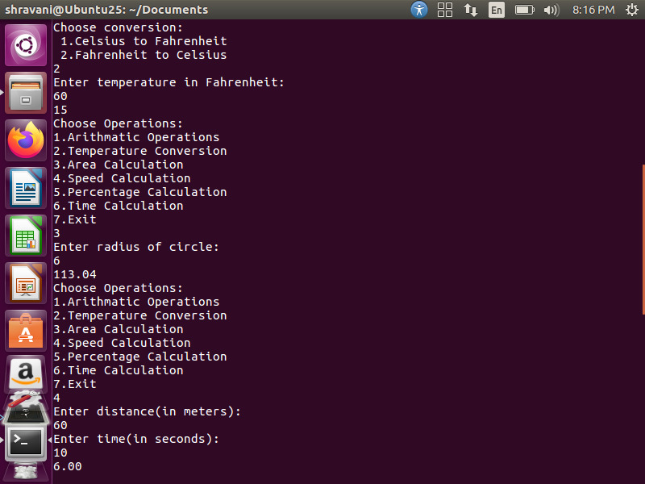
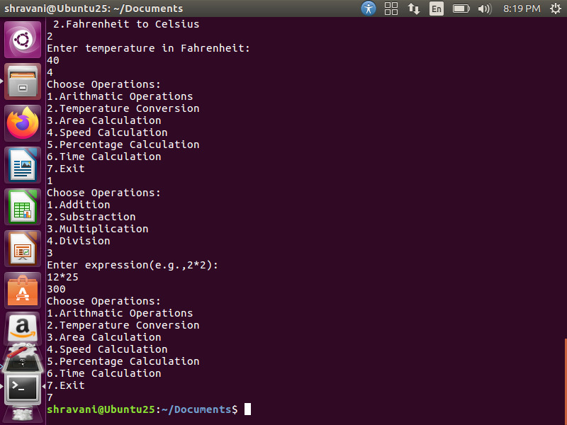

# ShellCalc

ShellCalc is a simple command-line calculator written in Shell Script. It provides a variety of useful calculations through an interactive menu-driven interface.

## Features

- Basic arithmetic operations (Addition, Subtraction, Multiplication, Division)
- Temperature conversion (Celsius to Fahrenheit and vice versa)
- Area calculation (e.g., Square, Rectangle, Circle)
- Speed calculation
- Percentage calculation
- Time calculation (conversion between hours, minutes, and seconds)

## How to Use

1. Open a terminal.
2. Navigate to the folder where shellcalc.sh is located.
3. Run the script using the following command:

```bash
bash shellcalc.sh

Requirements

Bash Shell (Linux, macOS, or Git Bash for Windows)


Author

Shravani (GitHub: Shravani9529)

License

This project is open-source and free to use for educational and personal purposes.

## Demo Output

### Main Menu


### Addition Operation


### Temperature Conversion


### Area Calculation


### Speed Calculation
